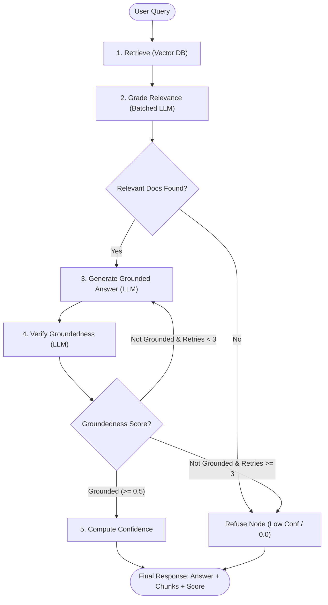

# Agentic AI RAG Chatbot (LangGraph + Vector DB)

[](https://www.python.org/)
[](https://github.com/langchain-ai/langgraph)
[](https://fastapi.tiangolo.com/)
[](https://streamlit.io/)
[](https://opensource.org/licenses/MIT)

> **Knowledge Base**: *"Agentic AI: An Executive's Guide"* by Konverge AI (60 pages, 6 chapters, 125 chunks)

A production-grade Retrieval-Augmented Generation (RAG) chatbot designed with a **stateful LangGraph pipeline**, featuring automated relevance grading, hallucination verification, automated retry loops, diagram/table ambiguity handling, and calibrated composite confidence scoring.

---

## 🌟 Key Features

1. **Stateful LangGraph Pipeline**: 6-node state machine (Retrieve → Grade Relevance → Generate Grounded Answer → Verify Groundedness → Compute Confidence / Refuse) with conditional routing and retry limits.
2. **Strict Knowledge Grounding**: Answers are synthesized strictly from the provided eBook context. Hallucination checks evaluate each generation and trigger automatic retries if claims lack grounded evidence.
3. **Calibrated Composite Confidence Score**: Dual-factor confidence formula combining normalized cosine similarity ($60\%$) with groundedness verification ($40\%$), empirically calibrated on the embedding distribution.
4. **Diagram & Table Fragment Handling**: Chunks extracted from visual flowcharts (pages 48–49) and multi-column tables (page 50) are tagged at ingestion, injecting steering disclaimers to prevent the LLM from inventing relationships.
5. **Flexible Multi-Backend Support**:
   - **Vector Store**: **ChromaDB** (zero-config, local persistent default) or **Pinecone** (cloud-managed).
   - **LLMs**: **Groq** (`qwen/qwen3.8-27b` default, free tier with exponential backoff) or **OpenAI** (`gpt-4o-mini`).
   - **Embeddings**: `all-MiniLM-L6-v2` via HuggingFace (local & free) or OpenAI Embeddings.
6. **Production Interfaces**: Complete **FastAPI** REST backend with OpenAPI/Swagger docs and an interactive **Streamlit** Web UI with citation inspection and confidence metrics.

---

## 🏗️ Architecture Overview

### LangGraph State Machine



### Composite Confidence Formula

$$\text{Confidence} = 0.6 \times \overline{S}_{\text{norm}} + 0.4 \times G$$

- $\overline{S}_{\text{norm}}$: Mean normalized cosine similarity clamped to $[0.0, 1.0]$ based on empirical calibration ($\text{LOW}=0.27$, $\text{HIGH}=0.90$).
- $G$: Groundedness verification score ($1.0$ = Fully Grounded, $0.5$ = Partially Grounded, $0.0$ = Not Grounded / Refusal).
- **Buckets**: `High` ($> 0.75$), `Medium` ($0.45 - 0.75$), `Low` ($< 0.45$ / Refusal).

For an exhaustive technical breakdown, see [architecture.md](file:///c:/Users/Dell/Downloads/AgenticRAG-LangGraph/architecture.md).

---

## 🚀 Quick Start (Local Setup)

Follow these steps to run the complete pipeline locally:

### 1. Clone & Set Up Environment

```bash
git clone <your-repo-url>
cd AgenticRAG-LangGraph

# Create and activate virtual environment
python -m venv venv
# On Windows:
.\venv\Scripts\activate
# On Linux/macOS:
source venv/bin/activate

# Install dependencies
pip install -r requirements.txt
```

### 2. Configure Environment Variables

Copy `.env.example` to `.env`:

```bash
cp .env.example .env
```

Open `.env` and provide your free Groq API key:
```ini
LLM_PROVIDER=groq
GROQ_API_KEY=gsk_your_groq_key_here
GROQ_MODEL=qwen/qwen3.8-27b
VECTOR_STORE=chroma
EMBEDDING_PROVIDER=sentence-transformers
EMBEDDING_MODEL=all-MiniLM-L6-v2
```
*(Get a free API key at [console.groq.com](https://console.groq.com))*

### 3. Ingest the eBook into the Vector Database

Place the `Ebook-Agentic-AI.pdf` file in the project root directory and run:

```bash
python -m src.ingest --recreate
```
*Output: Extracted 6 chapters, chunked into 125 documents, generated 384-dimensional embeddings, and saved to `chroma_db/`.*

### 4. Start the FastAPI Server

```bash
uvicorn api.main:app --reload --port 8000
```
- API Endpoint: `http://localhost:8000/chat`
- Swagger UI / Docs: `http://localhost:8000/docs`
- Health Status: `http://localhost:8000/health`

### 5. Launch the Streamlit Web UI

In a new terminal window:

```bash
streamlit run ui/app.py
```
Open `http://localhost:8501` in your browser to interact with the chatbot.

---

## 📡 API Reference

### `POST /chat`

**Request Body**:
```json
{
  "question": "How does Agentic AI differ from RPA and traditional LLMs?"
}
```

**Response**:
```json
{
  "answer": "Based on Chapter 1, Section 1.1 (\"The Terminology Maze\"), Agentic AI differs from RPA and LLMs in the following ways:\n\n* RPA excels at repetitive, rule-based tasks with structured data, whereas Agentic AI adapts to unstructured inputs and possesses autonomous decision-making capability.\n* LLMs are reactive text processors requiring prompts, whereas Agentic AI agents are autonomous, goal-driven systems that learn dynamically.",
  "retrieved_chunks": [
    {
      "text": "Robotic Process Automation (RPA) and Agentic AI...",
      "page_number": 9,
      "section": "1.1 The Terminology Maze",
      "similarity_score": 0.9686,
      "content_type": "text"
    },
    {
      "text": "The table below compares the key aspects of LLMs and agents...",
      "page_number": 10,
      "section": "1.1 The Terminology Maze",
      "similarity_score": 0.8626,
      "content_type": "text"
    }
  ],
  "confidence": 0.8289,
  "confidence_label": "High",
  "grounded": true,
  "refused": false
}
```

### `GET /health`

**Response**:
```json
{
  "status": "healthy",
  "vector_store": "chroma",
  "embedding_provider": "sentence-transformers",
  "embedding_model": "all-MiniLM-L6-v2",
  "llm_provider": "groq",
  "llm_model": "qwen/qwen3.8-27b"
}
```

---

## 📊 Benchmark Evaluation & Sample Queries

The system was evaluated against 6 benchmark queries covering every chapter of the eBook and negative refusal testing. Full logs are in [samples/sample_queries.md](file:///c:/Users/Dell/Downloads/AgenticRAG-LangGraph/samples/sample_queries.md).

| # | Benchmark Query | Chapter / Topic | Confidence | Label | Grounded? | Status |
|---|---|---|---|---|---|---|
| **1** | *"How does Agentic AI differ from RPA and traditional LLMs?"* | Ch 1: Terminology & Core Distinctions | `0.8289` | **High** | Yes (1.0) | 🟢 Answered |
| **2** | *"Explain the core pillars and anatomy of an Agentic AI system from perception to execution."* | Ch 2: Anatomy of Agentic AI | `0.9484` | **High** | Yes (1.0) | 🟢 Answered |
| **3** | *"What are the challenges of multi-agent systems and their mitigation strategies?"* | Ch 3: Section 3.4 Mitigations Table | `0.9046` | **High** | Yes (1.0) | 🟢 Answered |
| **4** | *"What are the four readiness levels in the industry-specific AI readiness analysis?"* | Ch 5: Readiness Levels (1–4) | `0.9529` | **High** | Yes (1.0) | 🟢 Answered |
| **5** | *"What impact did the Factory 4.0 use case deliver?"* | Ch 6: Industrial Case Studies | `0.4000` | **Low** | Partial (0.5) | 🟢 Answered |
| **6** | *"Who is the Prime Minister of India?"* | Out-of-Scope Negative Test | `0.0000` | **Low** | Refused (0.0) | 🔴 Refused |

---

## 📂 Project Structure

```
AgenticRAG-LangGraph/
├── README.md                      # Comprehensive project guide & setup
├── architecture.md                # In-depth architectural & mathematical specification
├── requirements.txt               # Pinned project dependencies
├── .env.example                   # Environment configuration template
├── .gitignore                     # Git exclusion rules
├── Ebook-Agentic-AI.pdf          # Knowledge base source PDF (local, excluded from git)
│
├── src/                           # Core RAG pipeline package
│   ├── __init__.py
│   ├── config.py                  # Dynamic configuration & score normalization constants
│   ├── ingest.py                  # PDF parser, chapter mapper, metadata tagger & vector store indexer
│   ├── retriever.py               # Vector DB loader, distance-to-cosine conversion, score normalizer
│   ├── prompts.py                 # Batched grading, generation (with disclaimer), & verification prompts
│   ├── schemas.py                 # Pydantic schemas (ChatRequest, ChatResponse) & GraphState
│   └── graph.py                   # 6-node LangGraph state machine & execution entry point
│
├── api/                           # FastAPI service layer
│   ├── __init__.py
│   └── main.py                    # REST endpoints (/chat, /health, /) with CORS & error handling
│
├── ui/                            # Streamlit frontend
│   ├── __init__.py
│   └── app.py                     # Interactive chat UI with citation viewer & confidence badges
│
└── samples/                       # Benchmark data & evaluation
    └── sample_queries.md          # Full execution traces for all 6 benchmark queries
```

---

## ⚙️ Alternative Configuration Options

### Using Cloud Pinecone Vector Store
1. Create an index at [app.pinecone.io](https://app.pinecone.io) with dimension `384` and metric `cosine`.
2. Update `.env`:
   ```ini
   VECTOR_STORE=pinecone
   PINECONE_API_KEY=your_key_here
   PINECONE_INDEX_NAME=agentic-ai-rag
   ```
3. Run `python -m src.ingest --recreate`.

### Using OpenAI LLM & Embeddings
1. Update `.env`:
   ```ini
   LLM_PROVIDER=openai
   OPENAI_API_KEY=sk-your_key_here
   OPENAI_MODEL=gpt-4o-mini
   EMBEDDING_PROVIDER=openai
   EMBEDDING_MODEL=text-embedding-3-small
   ```
2. Re-ingest with `python -m src.ingest --recreate`.
