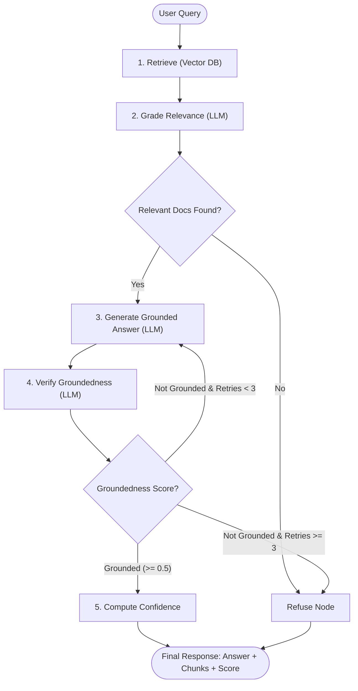

# System Architecture — Agentic AI RAG Chatbot

This document details the architectural design, state machine mechanics, mathematical formulas, and risk mitigations implemented in the **Agentic AI RAG Chatbot** for the Appening Infotech AI Engineering Intern task.

---

## 1. High-Level Architecture

The system implements an agentic Retrieval-Augmented Generation (RAG) architecture orchestrated with **LangGraph**. Unlike traditional linear RAG chains, this pipeline executes a stateful graph containing relevance grading, dynamic prompt steering, hallucination verification, automated retry loops, and composite confidence scoring.



---

## 2. LangGraph State Machine Specification

### State Definition (`GraphState`)

The state schema flows through all nodes in the directed acyclic/cyclic graph:

```python
class GraphState(TypedDict):
    question: str              # User query (immutable)
    documents: list[Document]  # Retrieved context chunks (filtered by grader)
    retrieval_scores: list[float]  # Normalized similarity scores [0.0 - 1.0]
    answer: str                # Generated response text
    groundedness: float        # 1.0 (fully), 0.5 (partially), 0.0 (not grounded)
    retry_count: int           # Counter for generation attempts (capped at 3)
    refused: bool              # Boolean flag indicating refusal
    confidence: float          # Composite confidence metric [0.0 - 1.0]
    confidence_label: str      # 'High', 'Medium', or 'Low'
```

### Node Mechanics

| Node | Input State | Output State | Description |
|---|---|---|---|
| **`retrieve`** | `question` | `documents`, `retrieval_scores` | Performs top-k vector search. Converts distances to cosine similarities and maps them through the empirical normalization function. |
| **`grade_documents`** | `question`, `documents` | `documents` (filtered) | Batched LLM evaluation. Evaluates all $k$ chunks in a single prompt and filters out irrelevant context. |
| **`generate`** | `question`, `documents`, `retry_count` | `answer`, `retry_count` | Generates a strictly grounded response. Conditionally injects diagram/table warnings if chunks originate from unstructured visual elements. |
| **`verify_groundedness`** | `documents`, `answer` | `groundedness` | Verifies whether factual claims in the answer are supported by the context (`fully_grounded` = 1.0, `partially_grounded` = 0.5, `not_grounded` = 0.0). |
| **`compute_confidence`** | `retrieval_scores`, `groundedness` | `confidence`, `confidence_label` | Computes the composite weighted confidence score based on vector similarity and verification verdict. |
| **`refuse`** | - | `answer`, `refused`, `confidence`, `confidence_label` | Emits an out-of-scope refusal message and forces confidence to 0.0 ("Low"). |

---

## 3. Confidence Score Mathematical Model

### Derivation & Formula

A naive confidence score relying purely on vector similarity suffers from semantic drift (e.g., an out-of-scope question retrieving irrelevant text with high distance, or an LLM hallucinating despite good retrieval).

The chatbot implements a dual-signal composite confidence formula:

$$\text{Confidence} = 0.6 \times \overline{S}_{\text{norm}} + 0.4 \times G$$

Where:
- $\overline{S}_{\text{norm}}$ is the mean normalized cosine similarity of the retrieved chunks.
- $G \in \{1.0, 0.5, 0.0\}$ is the groundedness verdict.

### Empirical Score Normalization

Raw cosine similarities for `all-MiniLM-L6-v2` naturally cluster between $[0.27, 0.90]$:
- In-scope queries with strong semantic alignment: $0.75 - 0.94$
- Moderate alignment / broader queries: $0.30 - 0.60$
- Out-of-scope noise / negative queries: $\le 0.10$

The normalization function rescales raw similarity $S_{\text{raw}}$ to $[0.0, 1.0]$:

$$S_{\text{norm}} = \text{clamp}\left(\frac{S_{\text{raw}} - \text{LOW}}{\text{HIGH} - \text{LOW}}, 0.0, 1.0\right)$$

With calibrated thresholds:
- $\text{LOW} = 0.27$ (natural floor for valid semantic matches)
- $\text{HIGH} = 0.90$ (ceiling preventing saturation)

### Qualitative Confidence Bucketing

| Range | Bucket | Interpretation |
|---|---|---|
| $> 0.75$ | **High** | High retrieval similarity and verified complete grounding. |
| $0.45 - 0.75$ | **Medium** | Moderate similarity or partial grounding. |
| $< 0.45$ | **Low** | Weak retrieval signal, failed grounding, or out-of-scope refusal. |

---

## 4. Ingestion & Table/Diagram Failure Mode Mitigations

### Structural Degradation in PDF Extraction

Extraction of visual elements from the 60-page eBook identified two critical risk areas:
1. **Decision Tree (Pages 48–49)**: Visual branching logic extracted as an unordered bag of labels (`Data Readiness`, `Insufficient data`, `Adequate`, `Skill Gap`). The flowchart connections do not survive plain-text extraction.
2. **Evaluation Matrix (Page 50)**: A 7-row × 5-column color-coded matrix where cell fragments collapse into flat linear text without column associations.

### Two-Tier Mitigation

1. **Metadata Tagging at Ingestion**:
   Every chunk generated from pages 48–49 is tagged with `content_type: "diagram_fragment"`, and page 50 is tagged with `content_type: "table_fragment"`. Standard prose is tagged `content_type: "text"`.
2. **Conditional Prompt Steering**:
   When any retrieved chunk contains non-text content, the `generate` node prepends an explicit disclaimer:
   ```text
   IMPORTANT — DIAGRAM/TABLE CONTENT WARNING:
   Some of the retrieved context below was extracted from a visual diagram or multi-column table.
   - State what the diagram/table covers at a high level.
   - Present individual elements that ARE explicitly stated.
   - Do NOT invent or assert relationships between elements that are not explicitly stated.
   ```
   This prevents the LLM from fabricating branch relationships or cell mappings.

---

## 5. Resilience & Rate-Limit Architecture

To ensure high availability on free-tier LLM providers (e.g. Groq 30 RPM / 7,000 ITPM / 1,000 OTPM limits):
1. **Batched Relevance Grading**: Merged $k$ individual grading prompts into 1 prompt returning a JSON array of relevant indices, reducing LLM calls by up to 60%.
2. **Tenacity Exponential Backoff**: Wrapped all LLM invocations in a retry decorator with exponential backoff (`multiplier=1.5`, `min=5s`, `max=40s`) to seamlessly handle HTTP 429 rate limit responses.
3. **Dual Vector Store Interface**: Unified abstraction layer supporting local persistent ChromaDB and cloud-native Pinecone without altering downstream graph nodes.
