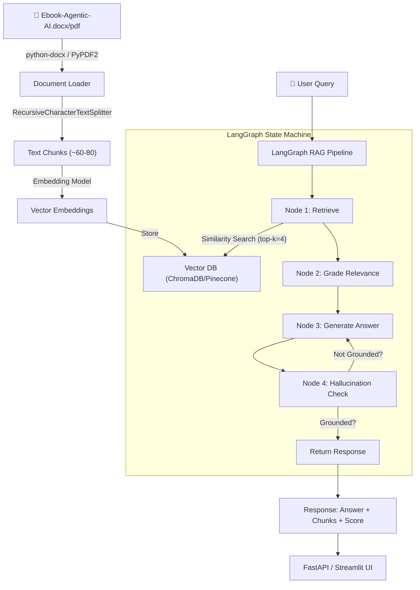

# Internship Task Analysis — Appening Infotech (AI Engineering Intern)

## Task Summary

Build a **RAG-based AI Chatbot** in Python using **LangGraph + Vector DB + Embeddings** that answers questions strictly from the Agentic AI eBook by Konverge AI.

---

## Knowledge Base Analysis

| Property | Value |
|---|---|
| **Source** | [Ebook-Agentic-AI.docx](file:///c:/Users/Dell/Downloads/AgenticRAG-LangGraph/Ebook-Agentic-AI.docx) |
| **Format** | Word (.docx), converted from a 60-page PDF |
| **Total paragraphs** | 341 |
| **Total chars** | ~37,000 |
| **Approx words** | ~5,200 |
| **Content quality** | Some OCR artifacts (є instead of e, 6 instead of A in some places) |

### Chapter Structure (6 chapters)

| # | Chapter | Key Topics |
|---|---|---|
| **01** | Introduction to Agentic AI | Definition, RPA vs Agentic AI, LLMs vs Agents, Reinforcement Learning distinction |
| **02** | Anatomy of an Agentic AI System | Core components, perception/reasoning/action layers, memory systems, tool use |
| **03** | Multi-Agent Systems | Agent roles, collaboration patterns, communication protocols |
| **04** | Orchestrating Agentic AI Systems | Orchestrator role, planning & task breakdown, verification, execution patterns (sequential/parallel), Sales Forecasting case study |
| **05** | Your Readiness for Agentic AI | Data readiness, infrastructure, talent assessment, ethical framework, decision tree, industry-wise readiness (Manufacturing/Healthcare/Finance/Retail/Construction) |
| **06** | Practical Applications of Agentic AI | Real-world use cases across industries |

> [!NOTE]
> The knowledge base is **small** (~5,200 words). This is actually advantageous — chunking and retrieval will be straightforward, and you can get very high answer quality. A chunk size of 500-800 chars with 100-150 overlap should produce ~60-80 chunks, which is manageable.

### Content Quality Issues
- OCR artifacts throughout: `є` appears instead of `e`, `6` appears instead of `A` in many places (e.g., "6gєntic 6I" = "Agentic AI")
- Some table data lost in conversion (comparison tables between LLMs and Agents)
- Decision tree diagram data is fragmented into individual labels

---

## Deliverables Checklist (What They Want)

| # | Deliverable | Weight | Notes |
|---|---|---|---|
| 1 | **GitHub Repo** (public) | Must-have | Clean structure, proper `.gitignore` |
| 2 | **README with setup instructions** | High | Step-by-step: clone → install → configure API keys → run |
| 3 | **Working RAG Chatbot** (API or UI) | Critical | FastAPI/Flask endpoint OR Streamlit/Gradio UI |
| 4 | **Sample queries (5-6)** | Medium | Include in README with expected answers |
| 5 | **Architecture explanation** | Medium | Diagram + short text in README |
| 6 | **Response format**: answer + context chunks + confidence score | Critical | Each response must return all three |

---

## Tech Stack Assessment

### What You Already Have Installed ✅

| Package | Version | Role |
|---|---|---|
| `langgraph` | 1.2.2 | ✅ Core requirement — RAG pipeline orchestration |
| `langchain` | 1.3.2 | ✅ Chain building, document loaders, text splitters |
| `langchain-text-splitters` | 1.1.2 | ✅ Chunking the PDF/docx |
| `langchain-openai` | 1.2.1 | ✅ OpenAI embeddings + LLM |
| `langchain-groq` | 1.1.2 | ✅ Free alternative LLM (Groq is free tier) |
| `sentence-transformers` | 5.6.0 | ✅ Local/free embeddings option |
| `openai` | 2.37.0 | ✅ Direct OpenAI SDK |
| `fastapi` | 0.136.1 | ✅ API option |
| `uvicorn` | 0.47.0 | ✅ ASGI server for FastAPI |
| `streamlit` | 1.57.0 | ✅ UI option |
| `gradio` | 6.19.0 | ✅ UI option |
| `flask` | 3.1.3 | ✅ API option |
| `tiktoken` | 0.13.0 | ✅ Token counting |
| `python-dotenv` | 1.2.2 | ✅ Environment variables |

### What You're Missing ❌

| Package | Why Needed |
|---|---|
| **Vector DB** (none installed) | Pinecone, ChromaDB, or FAISS needed for storing embeddings |
| `python-docx` | Just installed — needed to parse your .docx file |

---

## Architecture Options

### Option A: Pinecone (Cloud) — What Task Asks For
```
Pros: Task explicitly mentions Pinecone, cloud-hosted, scalable
Cons: Requires Pinecone API key (free tier = 1 index), network dependency
```

### Option B: ChromaDB (Local) — Simpler, No API Key
```
Pros: Zero config, runs locally, no API key needed, easy to demo
Cons: Task says "Pinecone or any Vector DB" — ChromaDB qualifies
```

### Option C: FAISS (Local, Facebook) — Fastest
```
Pros: Extremely fast, no server needed, in-memory
Cons: No persistence by default (need to save/load index)
```

> [!TIP]
> **Recommended: ChromaDB** as the primary choice with Pinecone as an optional flag. ChromaDB needs zero setup for reviewers to test your code, which makes a stronger demo. You can mention Pinecone support in README as a config option.

### LLM Options

| Option | Cost | Speed | Quality |
|---|---|---|---|
| **Groq (Llama 3.x)** | Free | Very fast | Good |
| **OpenAI GPT-4o-mini** | Cheap (~$0.01/query) | Fast | Excellent |
| **OpenAI GPT-4o** | More expensive | Fast | Best |
| **Google Gemini** | Free tier available | Fast | Good |

> [!TIP]
> **Recommended: Groq (free)** as default with OpenAI as option. You already have `langchain-groq` installed. This lets reviewers test without spending money.

---

## Proposed High-Level Architecture



### LangGraph Nodes Breakdown

| Node | Purpose | Details |
|---|---|---|
| **Retrieve** | Fetch relevant chunks | Similarity search on vector DB, return top-k (3-5) chunks |
| **Grade Relevance** | Filter irrelevant chunks | LLM judges if each chunk is relevant to query (yes/no) |
| **Generate** | Produce answer | LLM generates answer using only retrieved context |
| **Hallucination Check** | Grounding verification | LLM checks if answer is supported by context chunks |

---

## Suggested File Structure

```
AgenticRAG-LangGraph/
├── README.md                    # Setup instructions + architecture + sample queries
├── .env.example                 # Template for API keys
├── .gitignore                   # Exclude .env, __pycache__, chroma_db/
├── requirements.txt             # All dependencies
├── data/
│   └── Ebook-Agentic-AI.pdf    # Knowledge base (or .docx)
├── src/
│   ├── __init__.py
│   ├── config.py                # Settings, API keys, constants
│   ├── ingest.py                # PDF loading → chunking → embedding → vector store
│   ├── retriever.py             # Vector DB retrieval logic
│   ├── graph.py                 # LangGraph RAG pipeline (core logic)
│   ├── prompts.py               # System prompts for grounded answers
│   └── schemas.py               # Response models (answer, chunks, score)
├── api/
│   └── main.py                  # FastAPI app
├── ui/
│   └── app.py                   # Streamlit/Gradio chat UI
└── tests/
    └── sample_queries.py        # 5-6 sample queries with expected answers
```

---

## Sample Queries You Can Use (5-6)

Based on the actual knowledge base content:

| # | Query | Expected Answer Source |
|---|---|---|
| 1 | "What is Agentic AI and how is it different from traditional AI?" | Chapter 01 — core definition + distinctions |
| 2 | "How does Agentic AI differ from RPA and LLMs?" | Chapter 01 — RPA vs Agentic AI, LLMs vs Agents sections |
| 3 | "What are the core components of an Agentic AI system?" | Chapter 02 — anatomy, perception/reasoning/action layers |
| 4 | "Explain how multi-agent systems work together in Agentic AI" | Chapter 03 — collaboration patterns, communication |
| 5 | "What is the role of an Orchestrator in a multi-agent system?" | Chapter 04 — planning, task breakdown, verification |
| 6 | "How can an organization assess its readiness for adopting Agentic AI?" | Chapter 05 — decision tree, evaluation parameters |

---

## Risk & Effort Assessment

| Factor | Assessment |
|---|---|
| **Difficulty** | Medium — standard RAG pipeline, no exotic requirements |
| **Time estimate** | 6-8 hours of focused work |
| **48hr deadline** | Comfortable if you start today |
| **Biggest risk** | OCR artifacts in the docx may cause noisy retrieval |
| **Mitigation** | Pre-clean the text (replace є→e, 6gєntic→Agentic, etc.) during ingestion |

---

## Key Observations

1. **Small knowledge base is your advantage** — with only ~5,200 words, even simple RAG will work well. Focus on polish (UI, error handling, clean code) over complexity.

2. **OCR cleanup is critical** — the Word file has systematic character substitutions. A simple regex cleanup during ingestion will dramatically improve retrieval quality.

3. **LangGraph is the differentiator** — the task specifically asks for LangGraph, not just LangChain. Using LangGraph's state machine with proper nodes (retrieve → grade → generate → check) will impress. Most candidates will just use a simple chain.

4. **"Strictly grounded" is the key requirement** — they want to see that you handle hallucination. The hallucination check node in LangGraph is the right way to demonstrate this.

5. **Confidence score** — return the similarity scores from vector search. Average of top-k retrieval scores works as a simple confidence metric.

6. **Both API and UI will be stronger** — since you have both FastAPI and Streamlit installed, building both (API as core, Streamlit as wrapper) isn't much extra work and shows completeness.
